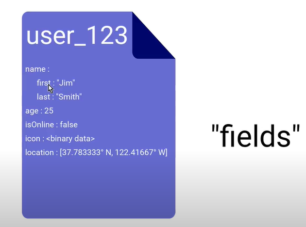
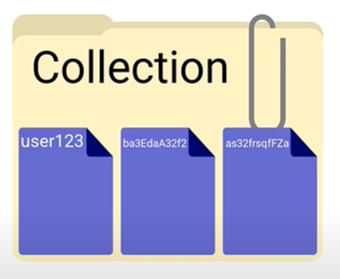
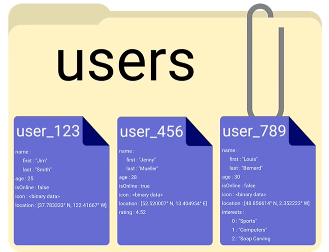
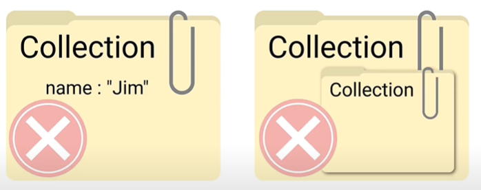
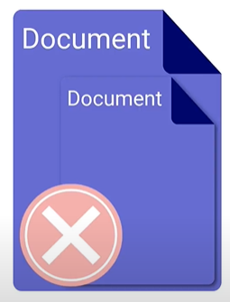
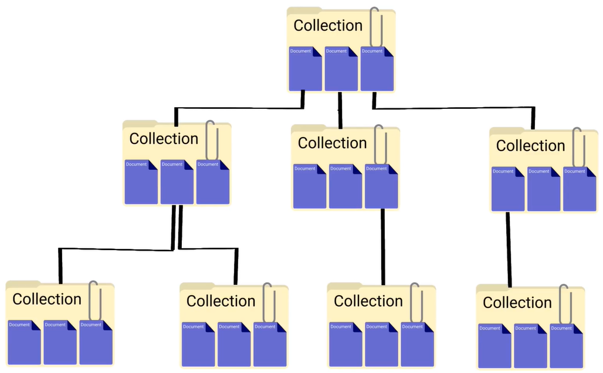
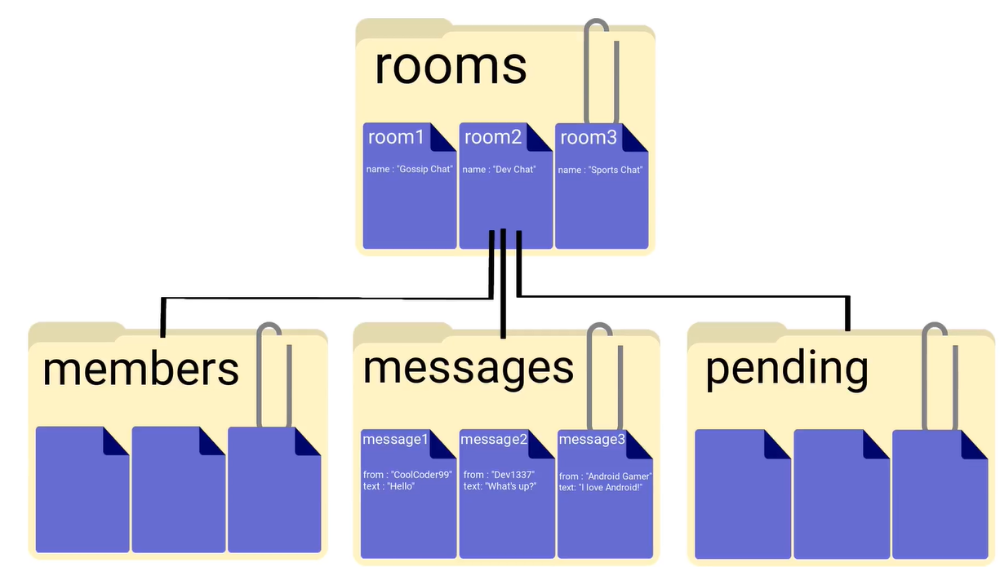

## Firebase Demo:

This project is my template for implementing as many Firebase services in a single app as I can.

-------------------------------------------

## Cloud Firestore:

<a href="https://firebase.google.com/docs/firestore">Cloud Firestore</a> is a NoSQL, cloud-hosted, flexible and scalable
database with offline support backed by Google. It's an easy solution for performing all the back-end part of your
business.

* NoSQL:<br/>
  In a NoSQL database, instead of managing data in tables with rows and columns (as in relational databases), it's
  stored in "documents" which contain a series of key-value pairs 👇👇<br/><br/>
  <br/><br/>
  The key-value pairs inside a document are referred to as "fields". Documents are basically some updated JSON files
  which support extra data types and also one single document can't be bigger than 1MB.<br/><br/>A document can store
  data types such as Strings, Integers, Booleans, Arrays, nested objects, raw binary values, coordinates, and some other
  complex data structures. <br/>
  In this context, nested objects are called <b>maps</b>; for example, in document above, "name" is a map with 2 parts
  for "first" and "last" name.<br/><br/>
  Documents are organized into "Collections" 👇👇<br/><br/>
  <br/><br/>
  Collections serve as folders for our documents. As you see above, each document within a collection has a unique ID;
  you can either choose ID of the documents yourself or let firestore automatically generate a random ID for them.

#### The root of a NoSQL database is always a collection, even if it only contains a single document.

The firestore database is schema-less (exactly on the opposite of XML based databases) which means we have the freedom
of putting any fields or data types into each separate document. We don't necessarily have to put the same fields into
documents of the same collection. For example 👇👇<br/><br/>
<br/><br/>
For example, in the collection of "users" we have above; we can later add more fields to some of those user documents without
breaking anything.

#### Warning: For querying purposes, it's usually better to have the same fields over multiple documents.

<br/>
<br/><br/>
👆👆 Collections can't contain anything other than documents; no raw fields, nor other collections. A collection can only contain 1 or more documents.
<br/><br/>
<br/><br/>
👆👆 A document can't contain other documents. However, a document can contain sub-collections 👇👇
<br/><br/>
<br/><br/>
It's often the case to have your NoSQL database as a collection that contains documents that contain sub collection that contains documents and so on, so forth. For example 👇👇
<br/><br/>
<br/><br/>
In the example picture above, we have the NoSQL database of a chat app that saves chatrooms in a collection called "rooms" where each room is represented by a document. And since firestore is optimized to host a large number of small documents (like tens of millions or even billions of small documents), we have stored each chat message in a separate document (all messages are in a collection named "messages").<br/><br/>
Collections and documents are created <b>implicitly</b>, we simply create a reference to them and set a value on that reference. If that document/collection doesn't exist, it'll be created; and if it exists, it'll be updated. Furthermore, when you delete a collection, all the documents within that  collection will be deleted as well. 

## **FireStore database also works offline.**

Of course you can't update anything in the cloud without internet connection but we have a copy of currently used
firestore database, cached on the device. Your app can query, listen, and make changes to this cached database. As soon
as user gets back online, this offline database will be synchronized with the cloud. For more info, have a
look <a href="https://firebase.google.com/docs/firestore/manage-data/enable-offline">here</a>.

-------------------------------------------

## **How to setup firestore in an Android project:**

For latest info about how to add firestore or other services of firebase to an Android project,
look <a href="https://firebase.google.com/docs/android/setup">here</a>.

While your project is open in Android Studio, go to "Tools/Firebase" and in the new window that shows up, follow all the instruction in the "Firestore" section.

Now if you look at your Gradle dependencies, you will have these new libraries added:

```
// Firestore database
implementation 'com.google.firebase:firebase-firestore:24.1.0'
```
 After doing all of these stuff, you will see the new project added to your Firebase console. In your console go to "Build" menu and choose "Firestore Database"; In the new page click on **Create Database**. 

 In the page below choose "test mode" and click Next 👇👇
 <br/><br/>
<br/><br/>
After choosing the location of your database (just choose some place that is nearest to the majority of your prospective users), you will see the mainpage for your Firestore database.

-------------------------------------------
-------------------------------------------

### **How to send your data back to Firestore database**:

You firstly need to have a reference to your Firestore database like this (better to define it as a Singleton class):

```
// A reference to Firestore database
val db = FirebaseFirestore.getInstance()
```

Imagine you have 2 string values named `title` and `description`; and you want to send them to the Firestore data base. You need to firstly create a key-value structure of that information like this:

```
// we need to firstly put our data into key-value pairs
// and then upload them into Firestore
  val note = HashMap<String, Any>().apply {
          this.put(KEY_TITLE, title)
          this.put(KEY_DESCRIPTION, description)
          }
```

And then, you will create a collection and document for saving this info to FireStore database. You even have some callbacks as scenarios for what to do if this database interaction was successful or resulted to an error. 👇👇

```
// Now we create a "Notebook" collection, the document
// "My First Note" inside that collection and will add
// our key-value pairs to that document.
  db.collection("Notebook").document("My First Note").set(note)
                .addOnSuccessListener {
                    // the call was successful
                    Toast.makeText(this, "Note saved successfully!", Toast.LENGTH_SHORT).show()
                }
                .addOnFailureListener {
                    // we've got an error
                    Toast.makeText(this, "Error occurred in database connection!", Toast.LENGTH_SHORT).show()
                    Log.e(TAG, "Firestore Error : ${it.message}")
                }
```

-------------------------------------------

## **How to Get data from Firestore database and display in your app**:

There are 2 different ways for doing that:

## 1. Retrieve the data by calling a method, for example when user clicks a button (this won't be in realtime):

This approach is easier to do, and for that, you firstly need to have a reference to the specific document you wanna load info from  👇

```
// A reference to the document that we're interacting with
val noteRef = db.collection("Notebook").document("My First Note")
```

In the code above we have created an object of type <a href="https://firebase.google.com/docs/reference/android/com/google/firebase/firestore/DocumentReference">DocumentReference</a> because we want to read data from a document, but you can also create a <a href="https://firebase.google.com/docs/reference/android/com/google/firebase/firestore/CollectionReference">CollectionReference</a>.
After defining a reference to your note, you will write the code for getting your needed info out of a <a href="https://firebase.google.com/docs/reference/android/com/google/firebase/firestore/DocumentSnapshot">DocumentSnapshot</a> in this way  👇

```
noteRef.get()
    .addOnSuccessListener {
        if (it.exists()) {
          // Get our needed data out of this DocumentSnapshot and load into TextView.
          val note = it.getData()
          binding.textViewData.text ="Title : ${note?.get(KEY_TITLE)}\nDescription : ${note?.get(KEY_DESCRIPTION)}"
                        } else {
                            Toast.makeText(this, "Document doesn't exist!", Toast.LENGTH_SHORT).show()
                               }
                          }
    .addOnFailureListener {
        Toast.makeText(this, "Error retrieving data!", Toast.LENGTH_SHORT).show()
        Log.e(TAG, it.message.toString())
                          }
```

At this point, if you keep playing with your app, your UI will be something like this 👇
<br/><br/>
<br/><br/>

## 2. Set a listener which will fetch data in realtime, as soon as something changes in documents of Firestore database:

When you're going to get data this way, it's really important to pay attention to Activity lifecycle. Register the listener in the `onStart()` callback of your activity 👇

```
 override fun onStart() {
        super.onStart()
        noteRef.addSnapshotListener { value, error ->
        }
    }
```
And inside this listener, you can write anything that you want to happen whenever this specific **document** inside Firestore changes. For example, I'm going to copy/paste the previous code in here 👇

```
 @SuppressLint("SetTextI18n")
    override fun onStart() {
        super.onStart()
        noteRef.addSnapshotListener { value, error ->
            if (error != null) {
                Toast.makeText(this, "Error while loading!", Toast.LENGTH_SHORT).show()
                Log.e(TAG, error.message.toString())
                return@addSnapshotListener
            }
            if (value?.exists() == true) {
                val note = value.data
                binding.textViewData.text =
                    "Title : ${note?.get(KEY_TITLE)}\nDescription : ${
                        note?.get(
                            KEY_DESCRIPTION
                        )
                    }"
            }
        }
    }
```
👆👆 As you can see, in the code above we have registered a listener to a specific **document** of Firestore in the `onStart()` callback of activity.

**The implementation above is kind of naive, mostly because it only registers the listener in the `onStart()` callback of the activity but doesn't pay attention to detaching it when the activity is being stopped.**

In order to solve this issue in an extremely easy way, Firestore provides an overloaded form of `addSnapshotListener()` method, which you can use like this 👇👇

```
 @SuppressLint("SetTextI18n")
    override fun onStart() {
        super.onStart()
        noteRef.addSnapshotListener(this) { value, error ->
            if (error != null) {
                Toast.makeText(this, "Error while loading!", Toast.LENGTH_SHORT).show()
                Log.e(TAG, error.message.toString())
                return@addSnapshotListener
            }
            if (value?.exists() == true) {
                val note = value.data
                binding.textViewData.text =
                    "Title : ${note?.get(KEY_TITLE)}\nDescription : ${
                        note?.get(
                            KEY_DESCRIPTION
                        )
                    }"
            }
        }
    }
```
This way, whenever `onStop()` callback of the activity is called, this listener will be automatically removed.

-------------------------------------------

## **Merge and Update on database**:

How we can update a single field in a document without overriding all of its other fields ?

For example, imagine we have changed the UI of our app to look like this 👇

<br/><br/>

And we want the feature that "when user clicks on **UPDATE DESCRIPTION**, only the `description` be updated in Firestore database; nothing else".

In order to do that, you can add this code line to your MainActivity's `onCreate()` callback 👇

```
binding.buttonUpdateDescription.setOnClickListener {
    // we get the input text of description EditText and
    // only update the field of "description" in the
    // corresponding document in Firestore (without
    // overriding any other data).
    val description = binding.editTextDescription.text.toString()
    val note = HashMap<String, Any>().also {
        it[KEY_DESCRIPTION] = description
    }
    /*
    * This code line only merges this data with the document in the corresponding DocumentReference.
    * In this case, */
    noteRef.set(note, SetOptions.merge())
}
```

**The code above merges the data to the document in corresponding `DocumentReference`, that's why other fields of document won't change.**